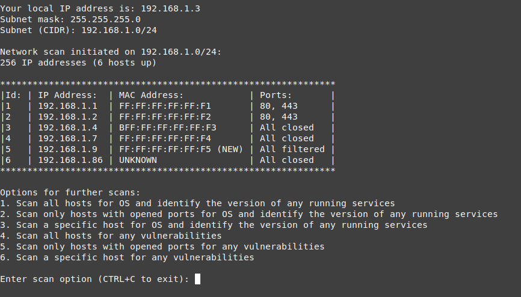

# network-scanner
The program uses Nmap to scan a subnet for any online hosts and then performs port scan on them. Results are then parsed and organized into a clean, user-friendly table format for easier consumption. Current scan results will be compared with the previous to detect any new devices in the network. The script will also get the user's network information like their local IP, subnet mask and the CIDR notation.

This script is solely for getting a quick overview of a network. 

Install Nmap (Debian Linux):

    $ sudo apt install nmap

Run it with the command:

    $ sudo ./network_scanner.sh <subnet?=hostSubnet>

`<subnet>` (optional) defaults to the user's subnet if not explicitly stated. 

 

### Reflections
My third bash script. This time, although still taking quite a bit time to finish, I felt a lot more comfortable working with bash. Many of the commands are starting to become more familiar to me the more I use them and oftentimes, I know which commands need to be used to achieve the results I want. Of course, not all is smooth sailing, I also did faced some challenges in this project trying to parse out and format certain data. But, nothing a little bit of Google can't solve.

I've definitely made progression since my last bash script and have learned more since then. From doing this project, I learned a lot about Nmap and certain networking knowledge such as subnets, ports, and scanning types. I also gained more practice with parsing and formatting using `awk`, `grep`, `cut`, and parameter expansion.